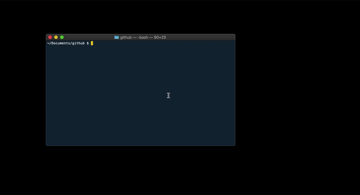

# git_open

A small utility function to open GitHub repos in a browser from the OSX terminal.

<p align='center'>
 <kbd>
  
 </kbd>
</p>

### Disclaimer

I'm very far from an experienced bash developer.  This is likely not follwing best practices and is not designed with portability in mind.

### Requirements

* Function assumes an `open` command exists to run open a browser at a specified url (e.g. `open https://google.com` will open Google in your default web browser)

### Installation

* Copy the below function code (or the contents of [git_open.sh](git_open.sh)) to `~/.bash_profile`
* Restart the Terminal or run `source ~/.bash_profile`

### Usage

* Navigate with Terminal to a git repo
* Run `git_open` to open the repo in a web browser

```bash
git_open(){
    remote=$(git config --get remote.origin.url)

    # If no remote found, exit
    if [ -z "$remote" ]; then
        echo "ERROR: Not a git repo, or no remote url set"
        return
    fi

    # Replace ssh style remote origin with https

    # Input: git@github.com:AdamSpannbauer/git_open.git
    # Output: https://github.com/AdamSpannbauer/git_open.git
    if [[ $remote == "git@"* ]]; then
        remote="${remote/git@/https://}" 
        remote="${remote/.com:/.com/}" 
    fi

    # Assumes OSX
    open "$remote"
}

```


